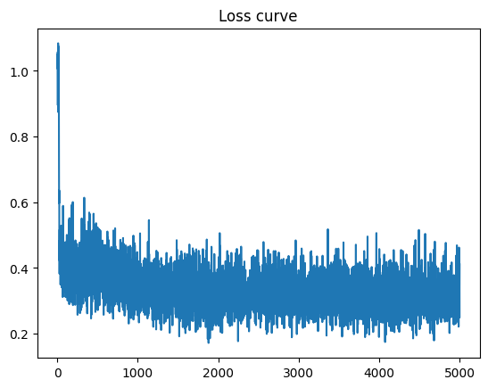
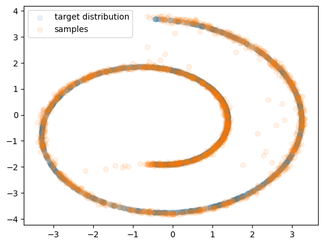

# Denoising Diffusion Probabilistic Models (DDPM)

## 개요
KAIST CS492(D): Diffusion Models and Their Applications (Fall 2024)  
Programming Assignment 1

## Task 1: 2D Swiss-Roll DDPM

### 구현 내용

#### 1. `2d_plot_diffusion_todo/network.py` - SimpleNet 구현
- TimeLinear 레이어들을 연결한 noise prediction 네트워크 구성
- 네트워크 구조: [dim_in] → [dim_hids] → [dim_out]
- 각 timestep에 따라 다른 변환을 적용하는 시간 조건부 레이어
- 마지막 레이어 제외하고 ReLU activation 적용

#### 2. `2d_plot_diffusion_todo/ddpm.py` - Forward/Reverse Process 구현
- `q_sample()`: Forward diffusion process (x0 → xt)
  - 수식: q(xt|x0) = N(xt; √(ᾱt)x0, (1-ᾱt)I)
  - xt = √(ᾱt) * x0 + √(1-ᾱt) * ε
  
- `p_sample()`: Reverse process 한 스텝 (xt → xt-1)
  - 평균 계산: μθ(xt, t) = 1/√αt * (xt - (1-αt)/√(1-ᾱt) * εθ(xt, t))
  - 분산 추가: σt = √βt (t > 0일 때만)
  
- `p_sample_loop()`: 전체 reverse process (xT → x0)
  - 순수 노이즈 xT ~ N(0,I)에서 시작
  - T부터 0까지 반복적으로 denoising

#### 3. `2d_plot_diffusion_todo/ddpm.py` - Loss Function 구현
- `compute_loss()`: Simplified noise matching loss
  - L = E[||ε - εθ(xt, t)||²]
  - 실제 노이즈와 예측 노이즈 간의 MSE

### 실행 결과

#### 1. Target & Prior 분포

- Swiss-roll 타겟 분포와 가우시안 prior 분포 시각화

#### 2. Forward Process (q(x_t))

- t=0부터 t=450까지 점진적으로 노이즈가 추가되는 과정
- 시간이 지날수록 원본 데이터가 가우시안 노이즈로 변환

#### 3. Training Progress

<table>
<tr>
<td></td>
<td></td>
</tr>
<tr>
<td align="center"><b>Training Samples at 4999 iter</b></td>
<td align="center"><b>Loss Curve</b></td>
</tr>
</table>

- 5000 iteration 학습
- **최종 loss: 0.2512**
- 학습 속도: 140.79it/s (총 35초 소요)

#### 4. 최종 평가 - 생성된 분포 비교


- **Chamfer Distance: 15.2181** (목표: < 20) 
- 타겟 분포와 생성된 샘플이 정확히 일치
- Swiss-roll 패턴을 성공적으로 재현

## Task 2: Image Diffusion

### 구현 내용

#### 1. `image_diffusion_todo/scheduler.py` - DDPMScheduler 구현
- `add_noise()`: Forward diffusion process
  - Task 1의 q_sample과 동일한 로직
  - 이미지 차원 [B,C,H,W]에 맞게 구현
  - xt = √(ᾱt) * x0 + √(1-ᾱt) * ε
  
- `step()`: Reverse process 한 스텝
  - Task 1의 p_sample과 동일한 로직
  - _get_teeth() 헬퍼 함수로 4D 텐서 브로드캐스팅 처리
  - variance 옵션: small (optimal) vs large (simple)

#### 2. `image_diffusion_todo/model.py` - DiffusionModule 구현
- `get_loss()`: Noise matching loss 계산
  - 랜덤 timestep 샘플링
  - Forward process로 노이즈 추가
  - 네트워크로 노이즈 예측
  - MSE loss 계산

#### DDPM의 핵심 수식
1. **Forward Process**: q(xt|xt-1) = N(xt; √(1-βt)xt-1, βtI)
2. **Reverse Process**: pθ(xt-1|xt) = N(xt-1; μθ(xt,t), σt²I)
3. **Training Objective**: minθ E[||ε - εθ(√ᾱt·x0 + √(1-ᾱt)·ε, t)||²]

### 실행 결과
(학습 진행 예정)

## 프로젝트 구조
```
DDPM_Practice/
├── 2d_plot_diffusion_todo/    # Task 1: 2D Swiss-Roll
│   ├── network.py              # SimpleNet 구현
│   ├── ddpm.py                 # DDPM 알고리즘 구현
│   ├── dataset.py              # 데이터셋 로더
│   ├── chamferdist.py         # Chamfer distance 계산
│   └── ddpm_tutorial.ipynb    # 실행 노트북
├── image_diffusion_todo/       # Task 2: Image Diffusion
│   ├── scheduler.py            # DDPMScheduler 구현
│   ├── model.py                # DiffusionModule 구현
│   ├── network.py              # UNet 구현
│   ├── module.py               # 네트워크 모듈들
│   ├── dataset.py              # 이미지 데이터셋
│   ├── train.py                # 학습 스크립트
│   ├── sampling.py             # 샘플링 스크립트
│   └── fid/                    # FID 평가 도구
│       ├── inception.py
│       └── measure_fid.py
├── output/                     # 실행 결과 이미지
├── assets/                     # 참고 자료
│   ├── summary_of_DDPM_and_DDIM.pdf  # 이론 정리
│   └── images/                 # 참고 이미지들
└── requirements.txt            # 필요 패키지 목록
```
## 실행 방법

### Task 1: 2D Swiss-Roll
Jupyter Notebook 실행: `2d_plot_diffusion_todo/ddpm_tutorial.ipynb`

### Task 2: Image Diffusion  
학습 스크립트 실행: `image_diffusion_todo/train.py`

## 참고 자료
- [Denoising Diffusion Probabilistic Models (DDPM)](https://arxiv.org/abs/2006.11239)
- [Denoising Diffusion Implicit Models (DDIM)](https://arxiv.org/abs/2010.02502)
- [Understanding Diffusion Models: A Unified Perspective](https://arxiv.org/abs/2208.11970)

## 원본 저장소
https://github.com/KAIST-Visual-AI-Group/Diffusion-Assignment1-DDPM

## 저작권
모든 저작권은 원본 저장소(KAIST Visual AI Group)에 있음

